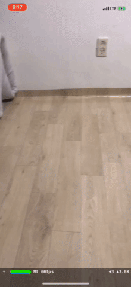
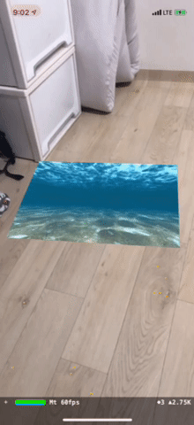

# Rx + ARKitSamples

## RxSwift + ReactorKit + ARKit
[ARKit](https://developer.apple.com/kr/arkit/) samples used [RxSwift](https://github.com/ReactiveX/RxSwift) and [ReactorKit](https://github.com/ReactorKit/ReactorKit)

## [Contents](Rx+ARKitSamples/ViewControllers/Samples)
### [Simple](Rx+ARKitSamples/ViewControllers/Samples/Simple)
Simple ARSCNView

### [Plane Detection](Rx+ARKitSamples/ViewControllers/Samples/PlaneDetection)
A sample to show how simply ARKit can detect planes.

### [Video Player](Rx+ARKitSamples/ViewControllers/Samples/VideoPlayer)
A sample to show Video on virtual world

## Refer
[ARKit-Sampler](https://github.com/shu223/ARKit-Sampler) 
[ARKit-Emperor](https://github.com/kboy-silvergym/ARKit-Emperor)

## Author
[tokijh](https://github.com/tokijh)

## License
Rx+ARKitSamples is available under the MIT License See the [LICENSE](https://github.com/tokijh/Rx-ARKitSamples/blob/master/LICENSE) file for more info.